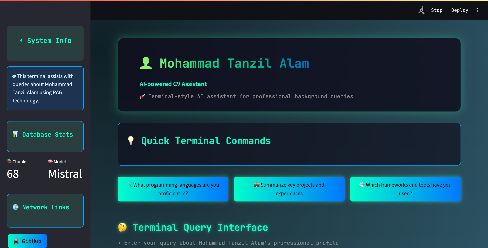
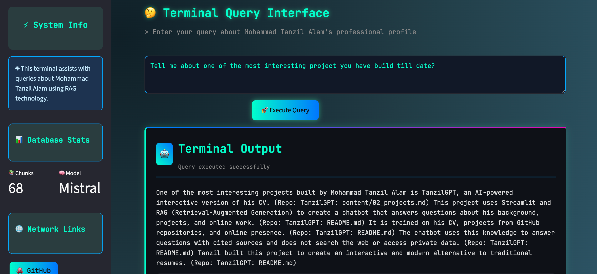

# AI-Powered CV Assistant

A sophisticated RAG (Retrieval-Augmented Generation) system that creates an interactive AI assistant for your CV and project portfolio. Users can ask natural language questions and get intelligent, cited responses about your professional background, skills, and projects (Knowledge Based).

## Demo

### Example Interaction

*Demo of asking about technical skills and getting organized responses*


## Features

- **Intelligent Question Answering**: Ask questions about skills, projects, experience, and education
- **Source Citations**: Every response includes numbered citations linking back to source documents
- **Modern UI**: Cyberpunk-themed interface with glowing effects and animations
- **Multi-Source Knowledge**: Processes both CV markdown files and GitHub repositories
- **Advanced RAG Pipeline**: Uses sentence transformers and FAISS for semantic search
- **Smart Chunking**: Respects document structure and semantic boundaries
- **Deduplication**: Prevents repetitive responses by removing duplicate content

## Architecture

```
┌─────────────────┐    ┌──────────────────┐    ┌─────────────────┐
│   Content       │    │   Index Builder  │    │   Query Engine  │
│   Sources       │───▶│   (prep_index)   │───▶│   (Streamlit)   │
└─────────────────┘    └──────────────────┘    └─────────────────┘
│                      │                       │
├─ CV Markdown         ├─ Text Extraction     ├─ Question Processing
├─ GitHub Repos        ├─ Smart Chunking      ├─ Semantic Search
└─ Project Docs        ├─ Embeddings (FAISS)  └─ LLM Generation
                       └─ Deduplication       
```
### Live Interface

*Main interface*


*Sample Question*

## Quick Start

### 1. Installation

```bash
# Clone the repository
git clone https://github.com/tanzilalam23/TanzilGPT_Chatbot.git
cd TanzilGPT_Chatbot

# Install dependencies
pip install -r requirements.txt
# For this project I'm using Python 3.11.13
```

### 2. Content Setup

Modify `content/` directory and add your CV as markdown files:

```
content/
├── 01_cv_public.md      # Your main CV content
├── 02_projects.md       # Projects links from GitHub
└── 03_links.md          # Links from Linked, Github, portfolio (optional)
```

**Important**: Include GitHub repository URLs directly in your markdown files. The system will automatically extract and clone them:

```markdown
## 02_projects.md

### My Data Science Project
Description of the project...
Repo: https://github.com/username/project-name

### Another Project
More details...
Repository: https://github.com/username/another-project
```

### 3. Configuration

Update `config.yaml` with your personal details:

```yaml
persona:
  name: "Your Name"
  style: "professional, concise, and well-organized"
  tagline: "AI-powered CV Assistant"
  github: "https://github.com/yourusername"
  linkedin: "https://linkedin.com/in/yourprofile"
```

### 4. Build Knowledge Base

```bash
python prep_index.py
```

This will:
- Extract GitHub URLs from your markdown files
- Clone/update repositories
- Process all content (CV + repos)
- Create embeddings and FAISS index
- Generate searchable knowledge base

### 5. Launch Application

```bash
streamlit run app.py
```

The app will be available at `http://localhost:8501`

## Project Structure

```
TANZILGPT/
├── app.py                 # Main Streamlit application
├── prep_index.py          # Knowledge base builder
├── config.yaml           # Configuration file
├── requirements.txt      # Python dependencies
├── content/              # Your CV markdown files
│   ├── 01_cv_public.md
│   └── 02_projects.md
│   └── 03_links.md
├── index/                # Generated knowledge base
│   ├── faiss.index
│   ├── chunks.jsonl
│   └── stats.json
├── models/               # Downloaded LLM models
├── repos/               # Cloned GitHub repositories
└── assets/              # Images and GIFs for documentation
    ├── app_interface.png
    └── example_interaction.gif
```

## Configuration Options

### LLM Settings
```yaml
llm:  
   gguf_repo: "TheBloke/Mistral-7B-Instruct-v0.2-GGUF"   # Model repository
  gguf_file: "mistral-7b-instruct-v0.2.Q4_K_M.gguf"      # Model file
  temperature: 0.1      # Lower = more focused responses
  max_tokens: 800       # Maximum response length
```

### Chunking Parameters
```yaml
chunking:
  chunk_size: 400       # Words per chunk
  overlap: 80          # Overlapping words between chunks
  min_chunk_words: 15  # Minimum words per chunk
```

### Embedding Model
```yaml
embeddings:
  model_name: "sentence-transformers/all-MiniLM-L6-v2"
```

## Supported File Types

The system processes these file types from your repositories:

- **Documentation**: `.md`, `.txt`
- **Code**: `.py`, `.js`, `.css`, `.sql`, `.r`, `.sh`
- **Notebooks**: `.ipynb`
- **Web**: `.html`, `.htm`
- **Data**: `.json`, `.yml`, `.yaml`
- **Documents**: `.pdf`

## Troubleshooting

### Common Issues

**"Index files not found"**
- Run `python prep_index.py` to build the knowledge base first

**"Model download failed"**
- Check internet connection
- Ensure sufficient disk space (models are ~2-4GB)

**"No documents collected"**
- Verify `content/` directory exists with `.md` files
- Check that GitHub URLs are correctly formatted in your markdown

**Poor response quality**
- Increase `retriever.k` in config for more context
- Adjust `chunking.chunk_size` for better granularity
- Ensure your CV content is well-structured with clear sections

### Performance Optimization

**For better speed:**
- Use smaller embedding models
- Reduce `chunk_size` and `retriever.k`
- Use CPU-optimized GGUF models

**For better quality:**
- Use larger models (Phi-3 or Llama-3)
- Increase `max_tokens` for longer responses
- Add more detailed content in your CV files

## Advanced Usage

### Custom Prompting
Modify the `SYSTEM_PROMPT` in `app.py` to change the AI's behavior and response style.

### Adding New Content Types
Extend `extract_text_from_file()` in `prep_index.py` to handle additional file formats.

### Deployment
For production deployment:
1. Use Docker for containerization
2. Consider cloud GPU instances for faster inference
3. Implement caching for frequently asked questions
4. Add authentication if needed

## Contributing

1. Fork the repository
2. Create a feature branch
3. Make your changes
4. Test thoroughly
5. Submit a pull request

## License

MIT License - see LICENSE file for details

## Technical Stack

- **Frontend**: Streamlit with custom CSS
- **LLM**: Local GGUF models via llama-cpp-python
- **Embeddings**: Sentence Transformers
- **Vector DB**: FAISS
- **Processing**: Python with asyncio support
- **Git Integration**: GitPython for repository handling

---
